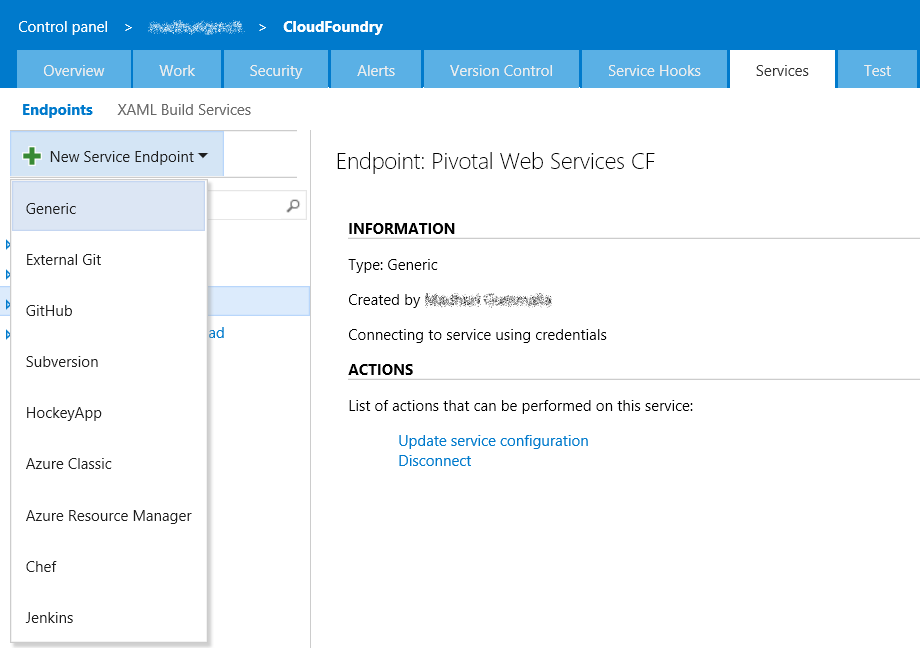
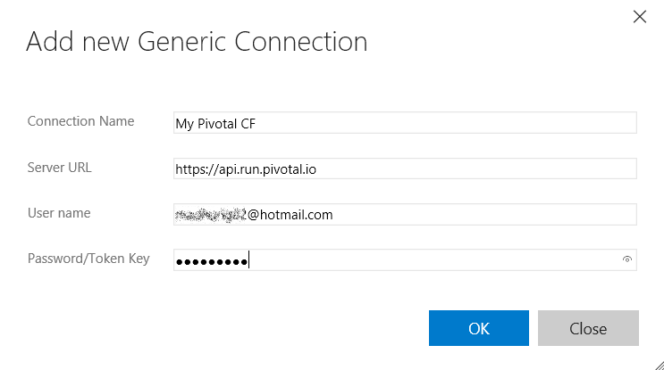
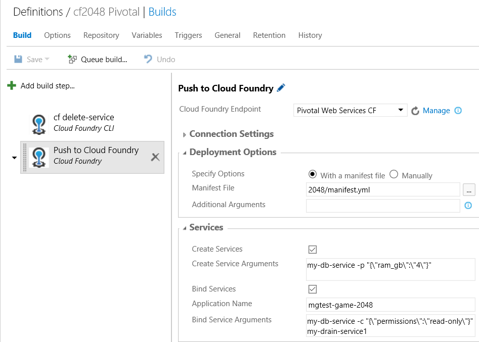

# vsts-cloudfoundry
Cloud Foundry build extension for Visual Studio Team Services allows you to automated the deployment process to any Cloud Foundry instance. This extension provides a build task to enable you to push applications to any Cloud Foundry instance. It also includes a Utility task to run any Cloud Foundry CLI commands as part of your build process.

## Create a Cloud Foundry Connection
Create a Generic Service Endpoint and specify your Cloud Foundry API endpoint URL, email/username and password.

Open the settings/admin page for your account and go to `Services` tab.

Enter the endpoint details.

## Define your build process
Create a build definition to automate your build process. For detailed instructions on setting up a build definition, check [this](https://msdn.microsoft.com/Library/vs/alm/Build/vs/define-build)

Add the Cloud Foundry Build tasks to your build steps and setup the arguments. The `Cloud Foundry` build task to push applications to Cloud Foundry can be found under `Deploy` category. The `Cloud Foundry CLI` task to run any Cloud Foundry CLI command can be found under the `Utility` category.

 

## Install Cloud Foundry CLI on your build agent
The task will look for the Cloud Foundry CLI in the PATH on the build machine. An alternate path to the Cloud Foundry CLI can be specified in the `Advanced` section of the task. This can be a local path on the build machine or a server path.

If you are using your own agent, install the [Cloud Foundry CLI](https://github.com/cloudfoundry/cli#downloads) on your build server. 
If you are using the hosted agent, you will need to checkin the [Cloud Foundry CLI](https://github.com/cloudfoundry/cli#downloads) to your repository and provide that server path in the task. We are looking into installing Cloud Foundry CLI on the hosted build machines or packaging it with the extension for the next release.

## Contributing
We love and encourage community contributions. To contribute:
1. Submit issues for bugs or suggestions to help us improve the extension
1. Fork the code and submit pull requests for any bug fixes or features

## Build pre-requisites
1. This package requires `node` and `npm`

## To compile, please run:
1. npm update
1. gulp

The vsix package will be produced in `_package`, and it can be uploaded to Visual Studio Team Services Marketplace for sharing. 
